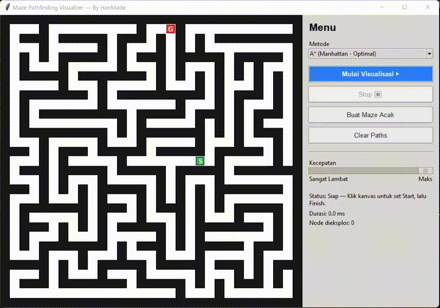

# Maze Pathfinding Visualizer (GUI)



Visualizer GUI interaktif untuk **pembelajaran & pencarian jalur tercepat pada maze**—dengan animasi realtime, timer durasi, dan panel kontrol yang rapi. Mendukung metode klasik (graph search) **dan** metode AI berbasis **Reinforcement Learning**.

## Fitur Utama
- **Algoritma**: 
  - BFS (Shortest Path – unweighted)  
  - Dijkstra (unweighted demo)  
  - A* (heuristik Manhattan – optimal pada biaya seragam)  
  - Greedy Best-First (heuristik, tidak selalu optimal)  
- **Visualisasi realtime**: sel yang dieksplor, jejak garis, dan **highlight** jalur akhir.
- **Timer** & **jumlah node dieksplor** untuk membandingkan performa antar-metode.
- **UI interaktif**: 
  - Kanvas maze di kiri, panel kontrol di kanan (tombol styled).
  - Klik kanvas **bergantian** untuk set **Start → Finish** (marker selalu di atas garis).
  - **Kecepatan** dapat diatur (0 = sangat lambat, 100 = maksimal).
  - **Buat Maze Acak** dan **Clear Paths**.
- **Maze acak** dengan *recursive backtracker* (perfect maze).

## Persyaratan
- **Python 3.8+**
- **tkinter** (biasanya sudah termasuk di instalasi Python standar pada Windows/macOS; di Linux bisa perlu paket `python3-tk`).

## Menjalankan
```bash
python3 maze_visualizer.py
